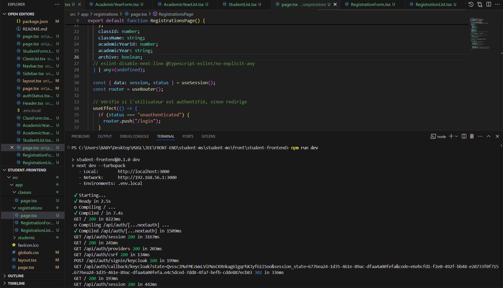
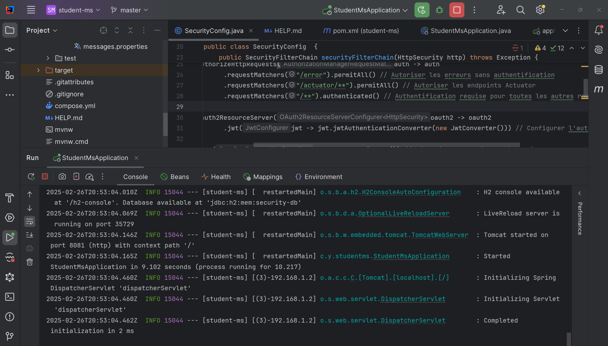
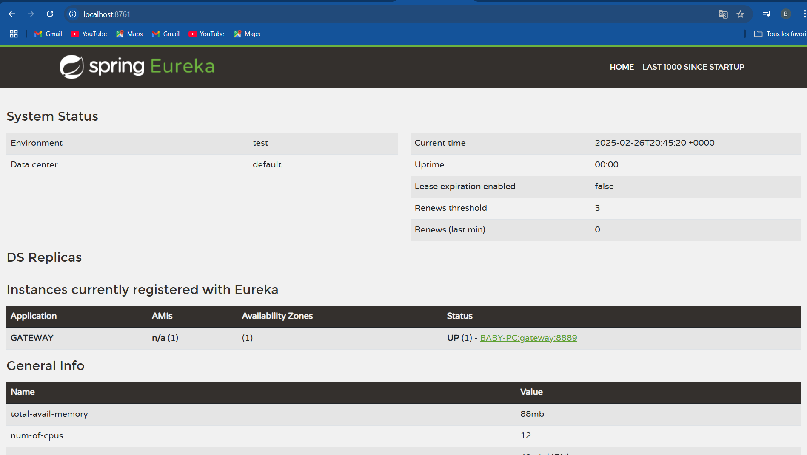
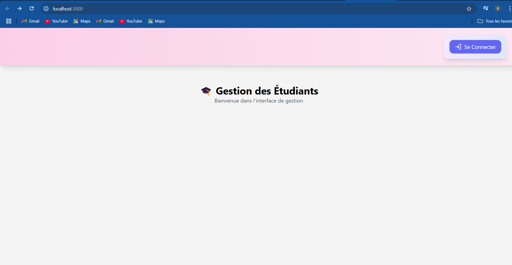
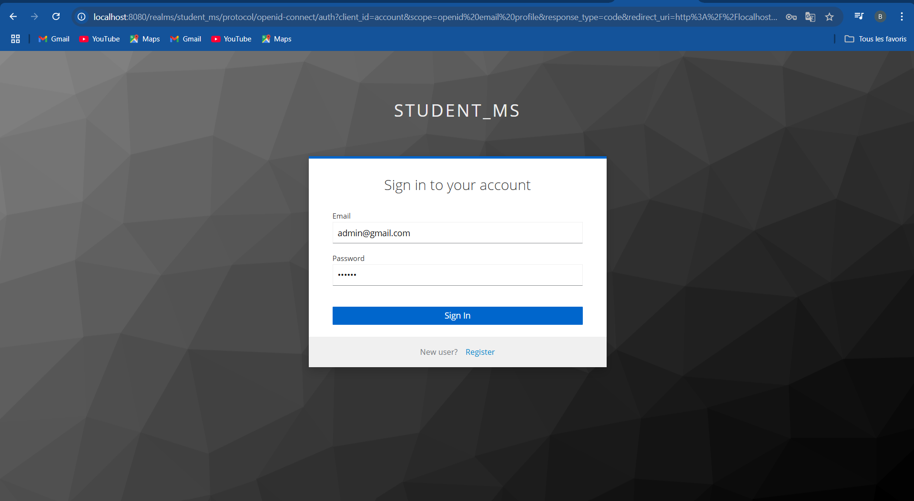
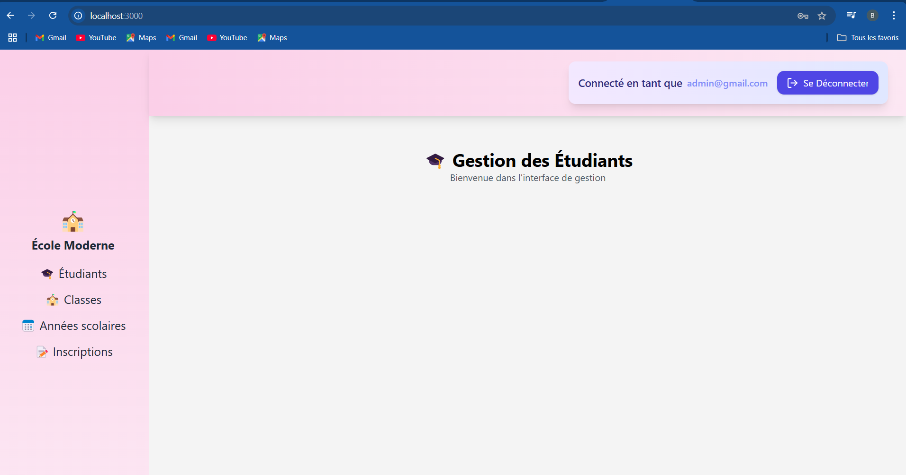
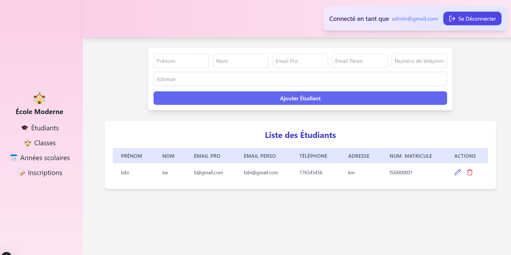
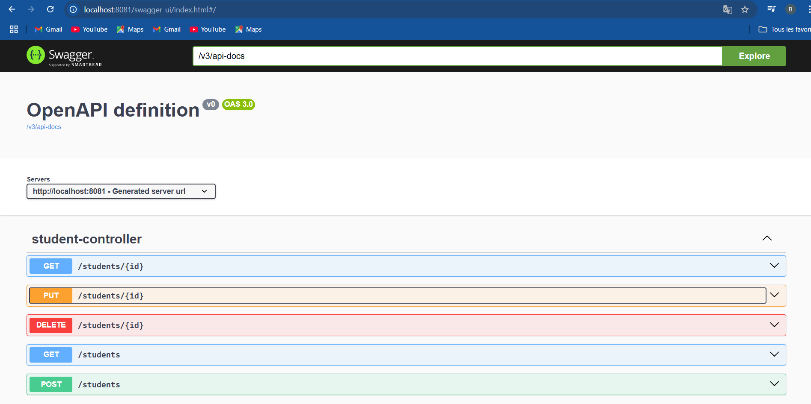
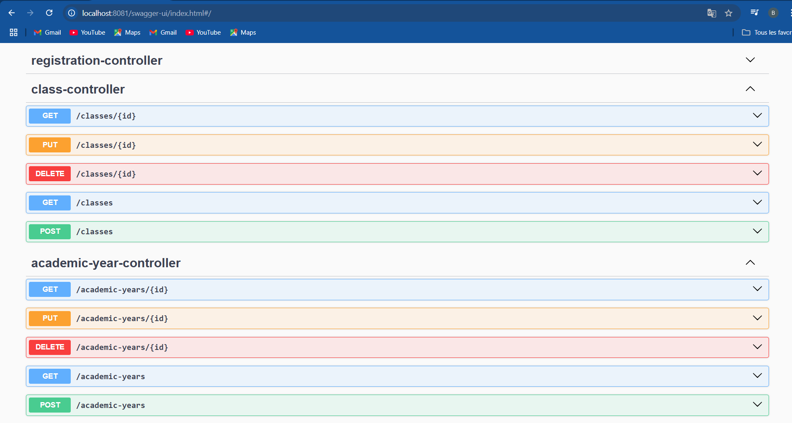

#   📌 Notions clés

#   🔹 Service Registry

Le Service Registry enregistre uniquement les services (comme les microservices).

Ce qu’il fait vraiment :

-Stocke les adresses et ports des services.

-Permet aux services de se découvrir et de communiquer.

=Met à jour les services en cas de changement (nouvelle instance, suppression, etc.).
#   🔹 API Gateway

L'API Gateway est un point d’entrée unique qui dirige les requêtes vers les bons services.

-Elle ne s’enregistre pas forcément dans le Service Registry.

-Toutefois, elle peut l'utiliser pour savoir où envoyer les requêtes.

#   🚀 Installation et Exécution
#   ✅ Prérequis
Assurez-vous d'avoir les outils suivants installés :

```bash
- Node.js et npm
- Java 17+
- PostgreSQL
- Maven
- Docker
```

#   🖥️ Démarrage des services
#   🔹1. Authentification & Tokens
-Démarrer Keycloak avec Docker. 

-Configurer les tokens correctement.

#   🔹 2. Lancer le Frontend

```bash
npm install
npm run dev
```


#   🔹 3. Lancer le Backend

Assurez-vous que PostgreSQL est configuré et en cours d'exécution.

```bash
mvn clean install
mvn spring-boot:run
```
Votre appli est en cours....



#   🔹 4. Lancer la gateway

```bash
mvn clean install
mvn spring-boot:run
```

#   🔹 5. Lancer le Service Registry 

```bash
mvn spring-boot:run
```
Interface Eureka disponible sur : http://localhost:8761

Vérifiez que votre API Gateway apparaît sous le nom GATEWAY.

Si ce n'est pas le cas, assurez-vous qu'elle est bien démarrée.



#   ✅ Vérification des fonctionnalités

🔹 Frontend

Connectez-vous pour accéder au Dashboard.





Voilà votre dashboard:







🔹 Backend

Vous pouvez les tester avec swagger






